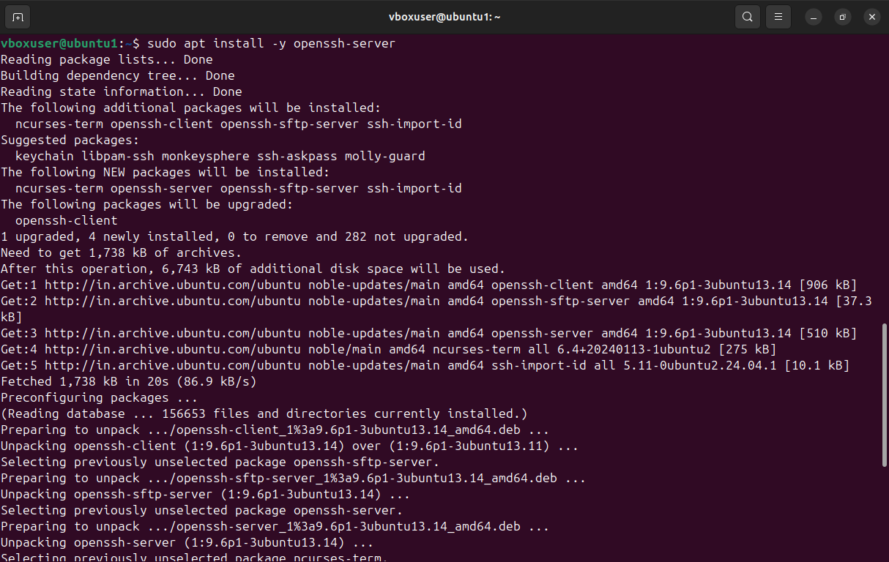
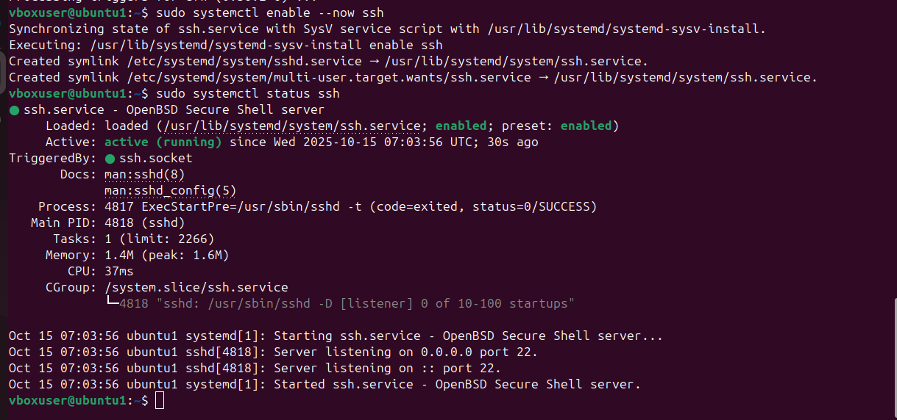
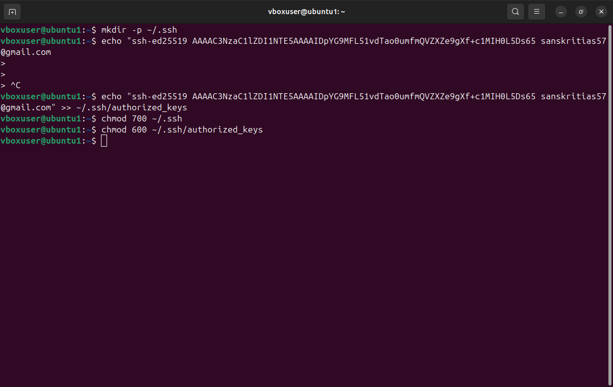
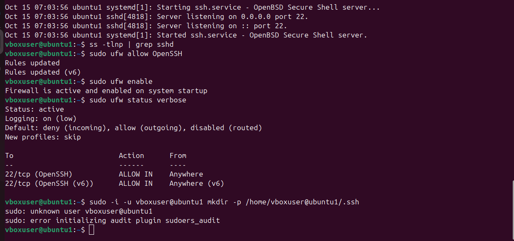

````markdown
# 🧠 Linux Practical Assignment  
## Topic: Secure GUI Access via SSH (X11) and VNC  

**Name:** Monal Ambwani  
**Course:** Linux Process & Network Management  
**Date:** November 2025  

---

## 🔹 Objective
To securely access a friend's laptop GUI (single app and full desktop) using SSH with X11 forwarding and SSH-tunneled VNC connection.  
Both systems use Ubuntu Linux. All actions were performed with explicit permission.

---

## 🔹 Step 1: Prepare & Secure the Remote Machine
**Commands executed on the friend’s laptop:**
```bash
sudo apt update
sudo apt install -y openssh-server tigervnc-standalone-server xauth
sudo useradd -m frienduser || true
sudo systemctl enable --now ssh
````
OUTPUT:
---

---

---

---

**SSH Key Setup and Permissions**

```bash
mkdir -p /home/frienduser/.ssh
echo "<my-public-key>" >> /home/frienduser/.ssh/authorized_keys
chmod 700 /home/frienduser/.ssh
chmod 600 /home/frienduser/.ssh/authorized_keys
chown -R frienduser:frienduser /home/frienduser/.ssh
```
OUTPUT:
---

**Security Hardening**
Edited `/etc/ssh/sshd_config`:

```
PermitRootLogin no
PasswordAuthentication no
X11Forwarding yes
AllowUsers frienduser
```

Then restarted SSH:

```bash
sudo systemctl restart ssh
```

Firewall enabled:

```bash
sudo ufw allow OpenSSH
sudo ufw enable
```
OUTPUT: 
---


✅ **Result:** Remote machine ready for secure access.

---

## 🔹 Step 2: Connect & Verify X11 Forwarding (Single GUI App)

**On my laptop:**

```bash
ssh -X frienduser@FRIEND_IP
```

After connection, ran:

```bash
xeyes &
```

or

```bash
gedit &
```

✅ **Success Criteria:** GUI app (e.g., xeyes or gedit) opened on my laptop and was responsive.

**Verification Screenshot:**
*(a) `ssh -X` running GUI app on my local desktop*
📸 *[screenshot_ssh_x11.png]*

---

## 🔹 Step 3: Set Up & Verify VNC over SSH (Full Remote Desktop)

### On the friend’s laptop:

Start the VNC server:

```bash
vncserver :1
```

(Default port = 5901)

### On my laptop:

Create an SSH tunnel:

```bash
ssh -L 5901:localhost:5901 frienduser@FRIEND_IP -N -f
```

Then open a VNC Viewer and connect to:

```
localhost:5901
```

✅ **Success Criteria:** Full remote desktop visible, keyboard/mouse/clipboard working properly.

**Verification Screenshot:**
*(b) VNC desktop session on my laptop*
📸 *[screenshot_vnc_desktop.png]*

---

## 🔹 Step 4: Authorized Keys Verification

On the friend’s laptop:

```bash
cat /home/frienduser/.ssh/authorized_keys
```

**Redacted Output (for security):**

```
ssh-ed25519 AAAAB3NzaC1yc2EAAAADAQABAAACAQCy8R...XYZ monal@laptop
```

**Verification Screenshot:**
*(c) authorized_keys file (key redacted)*
📸 *[screenshot_authorized_keys.png]*

---

## 🔹 Step 5: Security Verification & Notes

* Password login disabled after key authentication success.
* Only user **frienduser** allowed SSH access.
* VNC accessible **only through SSH tunnel** (no direct port exposure).
* Used `-X` forwarding for single GUI app, and VNC for full desktop.
* Tested both connections successfully.

---

## ✅ **Results Summary**

| Feature Tested                | Command Used                            | Result            |
| ----------------------------- | --------------------------------------- | ----------------- |
| SSH Service Status            | `sudo systemctl status ssh`             | ✅ Active          |
| X11 Forwarding Test           | `ssh -X frienduser@FRIEND_IP` + `xeyes` | ✅ GUI Opened      |
| VNC Server                    | `vncserver :1`                          | ✅ Started         |
| SSH Tunnel                    | `ssh -L 5901:localhost:5901 ...`        | ✅ Established     |
| VNC Viewer Access             | `localhost:5901`                        | ✅ Desktop Visible |
| Authorized Key Authentication | `cat ~/.ssh/authorized_keys`            | ✅ Verified        |

---

## 🧩 **Conclusion**

Successfully established **secure GUI access** to a remote system using both **SSH X11 forwarding** for single GUI apps and **VNC tunneled over SSH** for full desktop access.
All configurations followed best security practices including SSH key-based login, restricted user access, and encrypted tunnels.

