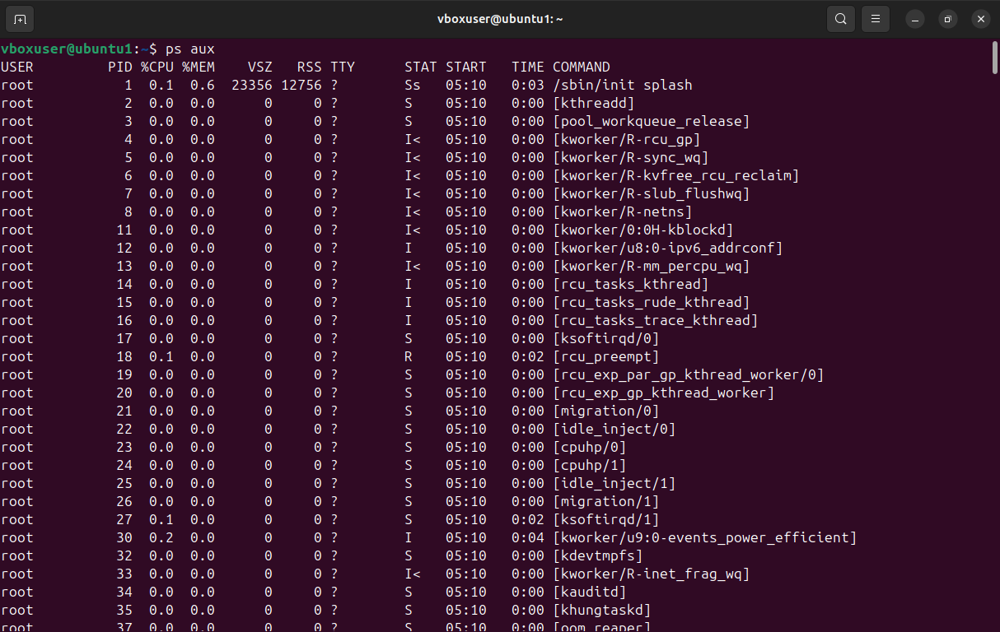
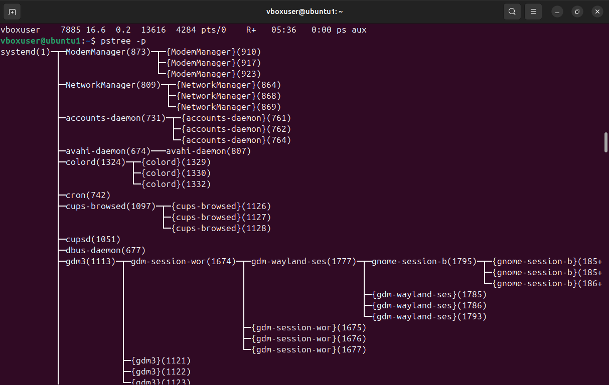

```markdown
# 🧠 Linux Process Management — Assignment (Practical Report)

---

## 🎯 Aim
To explore and practice various Linux process management utilities for monitoring, controlling, and managing active processes in a Linux environment.

---

## 🧩 Objective
- To list and analyze running processes.
- To visualize process hierarchies.
- To modify process priority and CPU binding.
- To observe I/O scheduling and system call tracing.
- To understand advanced resource control using cgroups.

---

## 🧰 Experiment Steps and Outputs

---

### 🔹 1. Viewing All Processes
**Command:**
```bash
ps aux
````

**Explanation:**

* **a** → Shows processes for all users
* **u** → Displays the user/owner of each process
* **x** → Includes processes not attached to a terminal

**Output:**

📎 **

---

### 🌲 2. Viewing the Process Tree

**Command:**

```bash
pstree -p
```

**Output:**
📎 **

**Explanation:**
Displays the hierarchical (parent-child) structure of all processes.


---

### 📊 3. Real-Time Process Monitoring

**Command:**

```bash
top
```

**OUTPUT**
📎 **

---

### ⚡ 4. Adjusting Process Priority

**Start Process with Low Priority:**

```bash
nice -n 10 sleep 300 &
```


**Change Priority of a Running Process:**

```bash
renice -n -5 -p 7997
```

Output:


📎 **

---

### 🔧 5. Setting CPU Affinity (Binding Process to Core)

**View Current CPU Affinity:**

```bash
taskset -cp 7997
```

**Restrict Process to Core 1:**

```bash
taskset -cp 1 7997
```

Output:

📎 **

---

### 📂 6. I/O Scheduling Priority

**Command:**

```bash
ionice -c 3 -p 7997
```

Output:

📎 **

---

### 📑 7. File Descriptors Used by a Process

**Command:**

```bash
lsof -p 7997 | head -5
```

Output:

📎 **

---

### 🐛 8. Tracing System Calls

**Command:**

```bash
strace -p 7997
```

Output:

📎 **

---

### 📡 9. Finding Process Using a Network Port

**Command:**

```bash
sudo fuser -n tcp 8080
```

Output:

📎 **

---

### 📊 10. Per-Process Statistics

**Command:**

```bash
pidstat -p 7997 2 3
```

Output:

📎 **

---

### 🔐 11. Control Groups (cgroups) for Resource Limits

**Create New cgroup:**

```bash
sudo cgcreate -g cpu,memory:/testgroup
```

**Set CPU and Memory Limits:**

```bash
echo 50000 | sudo tee /sys/fs/cgroup/cpu/testgroup/cpu.cfs_quota_us
echo 100M   | sudo tee /sys/fs/cgroup/memory/testgroup/memory.limit_in_bytes
```

**Add Process to Group:**

```bash
echo 3050 | sudo tee /sys/fs/cgroup/cpu/testgroup/cgroup.procs
```

---

### 🎯 12. Alternatives to `nice` / `renice`

| Tool            | Focus                            | Alternative to       |
| --------------- | -------------------------------- | -------------------- |
| **chrt**        | Real-time scheduling policies    | nice                 |
| **ionice**      | I/O priority control             | Complementary        |
| **taskset**     | CPU affinity control             | Complementary        |
| **cgroups**     | Fine-grained resource management | nice (more advanced) |
| **systemd-run** | systemd + cgroups control        | nice                 |
| **schedtool**   | Custom scheduling policies       | nice                 |


---

## ✅ Result

All listed Linux process management operations were successfully performed. Commands like `ps`, `top`, `kill`, `renice`, and `taskset` were tested, and system resource allocation behaviors were observed and verified.

---

## 🧾 Conclusion

This practical provided deep insight into how Linux handles multitasking, process hierarchies, scheduling priorities, and resource control mechanisms. Understanding these tools helps in system performance tuning and efficient process management.

---

*Created by:* **Monal Ambwani**
*Date of Completion:* `_03_/_10_/2025`
*System Used:* Ubuntu Linux

```

---


