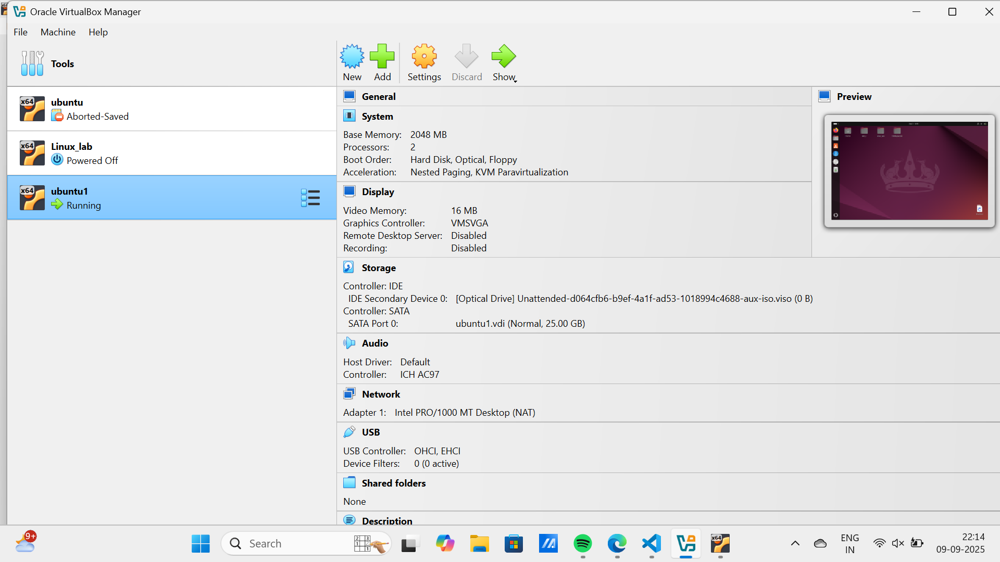
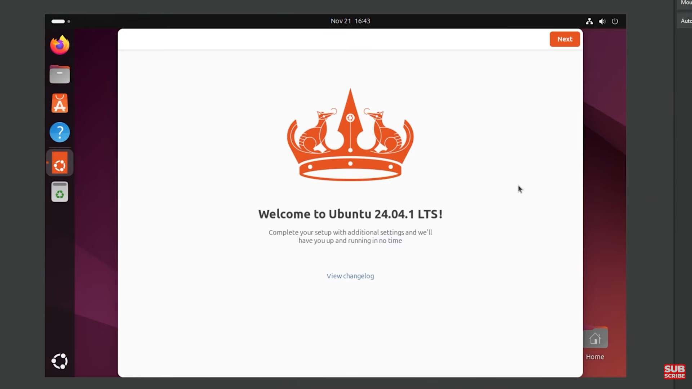
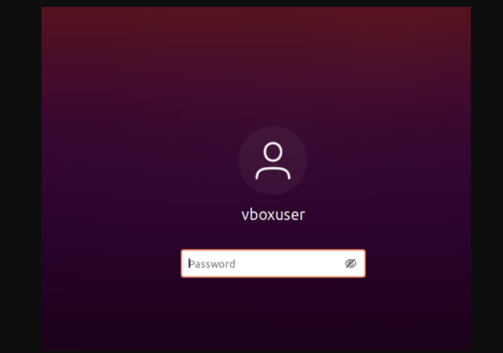
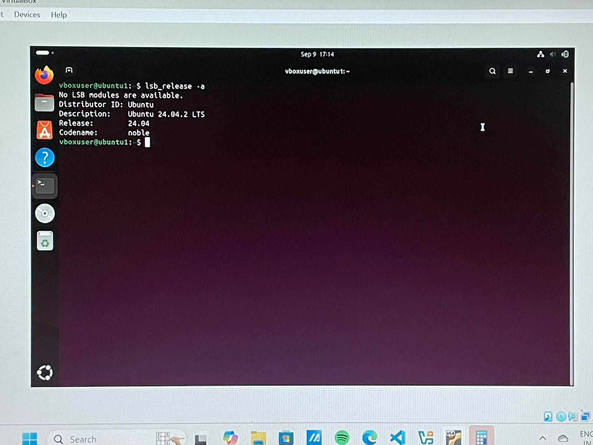
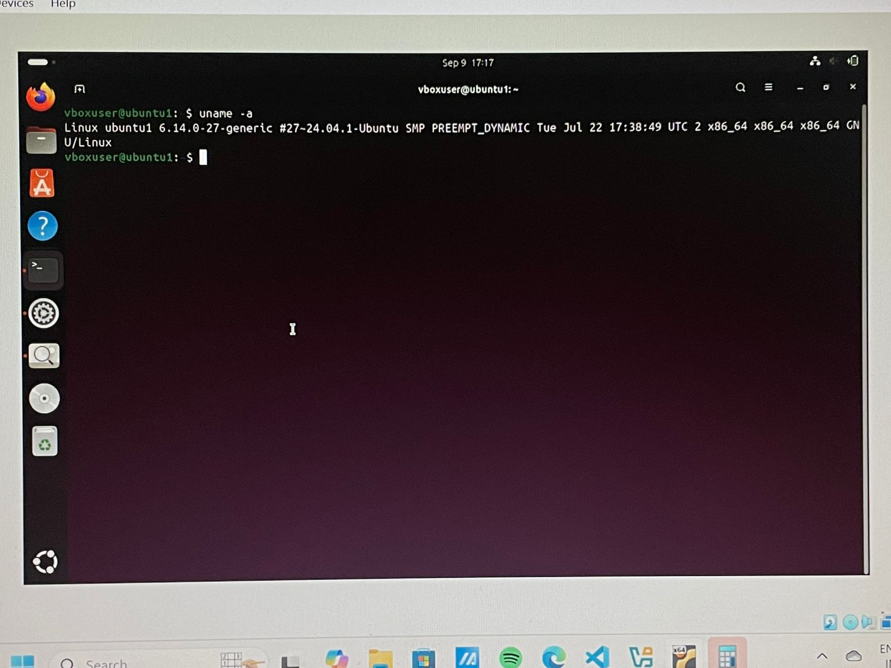
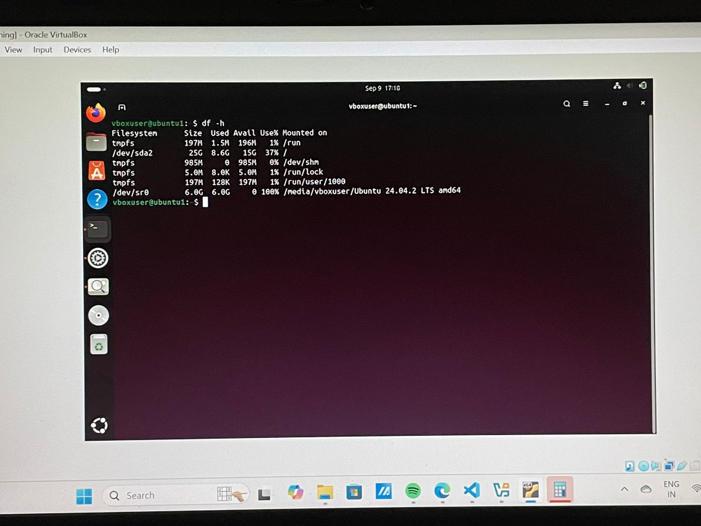
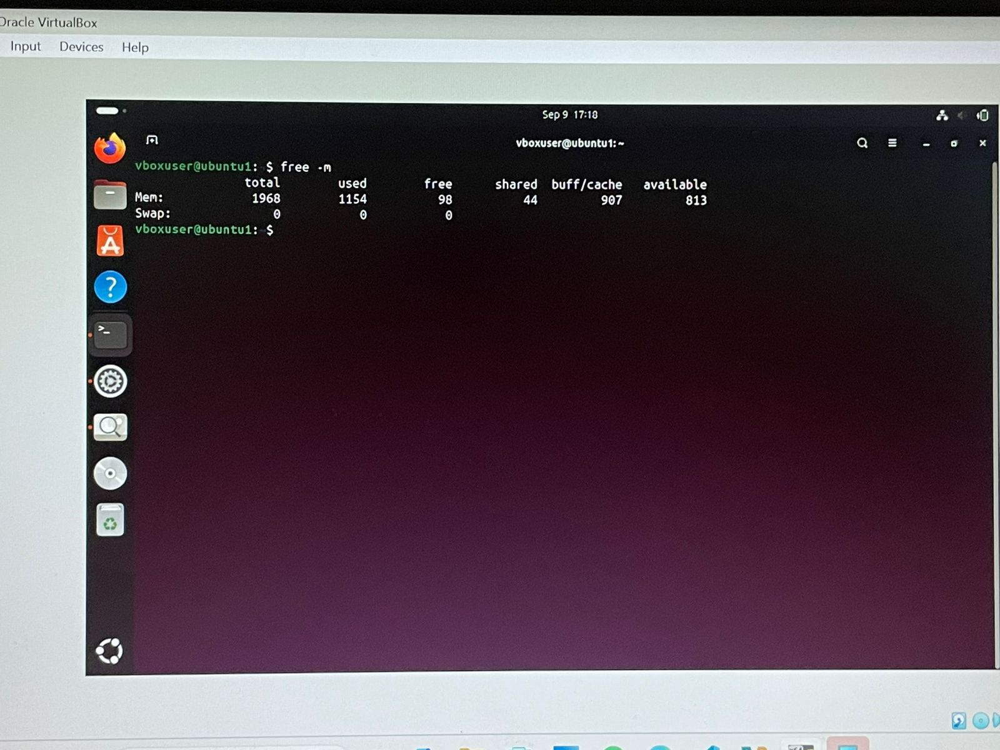

# LAB0 – Ubuntu Installation Report  

---

## 🖥️ Installation Method Chosen: Virtual Machine (VM)

I chose to install Ubuntu using **VirtualBox** on my existing system. Below are the steps I followed.

---

## 🔧 Step-by-Step Installation Process

### 1. Install VirtualBox  

### 2. Download Ubuntu ISO (LTS version)  

### 3. Create New VM (2 GB RAM, 20 GB disk)  

---

### 4. Install Ubuntu in the VM  

---

### 5. First Boot and Login  

---

## 💻 Terminal Commands & Outputs (Screenshots)

### 🔸 lsb_release -a  

---

### 🔸 uname -a  

---

### 🔸 df -h  

---

### 🔸 free -m  

---

## 💬 Reflection: Challenges Faced

Installing Ubuntu in VirtualBox was mostly straightforward, but a few challenges came up:

- **ISO Boot Issues:** Initially, the VM didn’t detect the ISO file. I had to manually configure the optical drive in the VM settings.
- **Slow Performance:** With limited RAM (2 GB), the system was a bit sluggish. Increasing system RAM helped slightly.
- **Guest Additions:** Installing VirtualBox Guest Additions for better screen resolution required some terminal work and wasn't automatic.

Despite these, the process gave me a good introduction to virtualization and Linux environments.

---

## ❓ Extra Questions

### ✅ What are two advantages of installing Ubuntu in VirtualBox?

1. **Safe Environment:** It allows running Ubuntu without affecting the host OS, making it ideal for beginners.
2. **Easy Reset & Snapshots:** You can take snapshots and roll back changes, which is helpful for experimenting or lab work.

---

### ✅ What are two advantages of dual booting instead of using a VM?

1. **Better Performance:** Dual booting gives native performance with full system resources.
2. **Real-world Experience:** It provides a more realistic Linux environment for development or system-level tasks.

---

## 📄 Final Deliverables

- `LAB0.md` (This file with screenshots)
- Convert to `LAB0.pdf`
- Upload to LMS

---

> 
