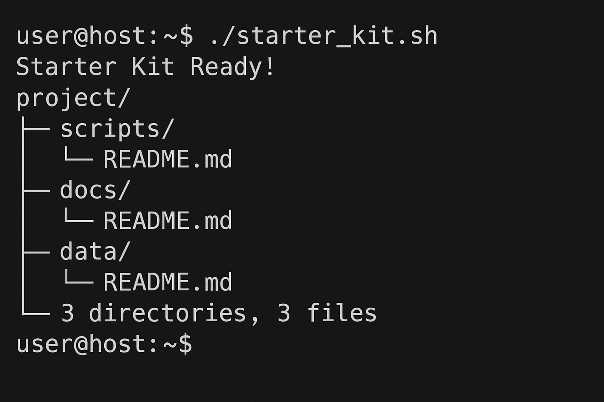

---


## LAB_extra.md – Starter Kit & Automation  

## Purpose of the Script  
This small shell script sets up a starter project for me.  
It makes a `project/` folder with `scripts/`, `docs/`, and `data/` inside it,  
and drops a `README.md` file in each one so I don't forget to add notes later.  

This saves time because I don’t have to create these folders manually every time.  

---

## Example Run  

I ran the script using:  

```bash
./starter_kit.sh
````

And got this output:

```
Starter Kit Ready!
```

After that, I checked the folder structure and it looked like this:

```
project/
├── data/
│   └── README.md
├── docs/
│   └── README.md
└── scripts/
    └── README.md
```

Here’s the screenshot of my terminal:
()

---

## Extra Questions

**1) What does `mkdir -p` do?**
It makes the directory *and* any missing parent folders.
If the folder already exists, it won’t give an error.
Example:

```bash
mkdir -p project/scripts
```

will create `project/` if it isn’t there and then make `scripts/` inside it.

---

**2) Why is automation useful in DevOps?**
Because it saves a lot of time and makes things consistent.
Instead of doing the same steps again and again,
you just run a script and get the same result every time — no human mistakes.

---

```

---


