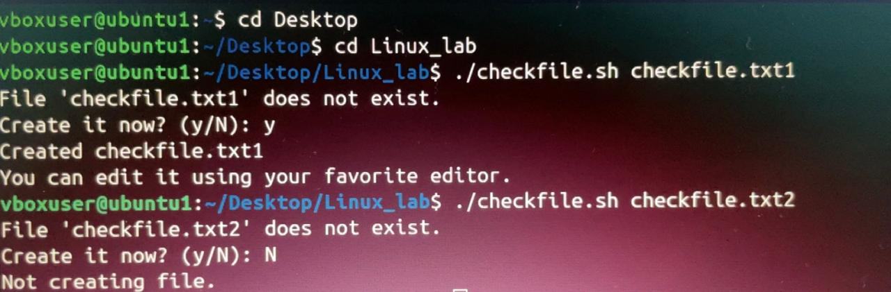

# CHECK FILE PERMISSION

'''
## CODE

## LINE BY LINE EXPLANATION

* `#!/bin/bash` → Tells the system to use the **bash shell** to run this script.

* `$#` → Number of arguments passed to the script.
* `-ne 1` → Tests if the number is **not equal to 1**.
* `fi` ends the `if` statement.
* `$1` → First argument passed to the script.
* `-e "$file"` → Checks if the file exists.
*  `cat -- "$file"` displays the contents of the file.
* `else` runs if the file **does not exist**.
* `read -p "Create it now? (y/N): " ans`
  * Displays the prompt and waits for user input.

* `touch "$file"` creates a new empty file.

* `fi` closes the if-else block.

---
## OUTPUT

